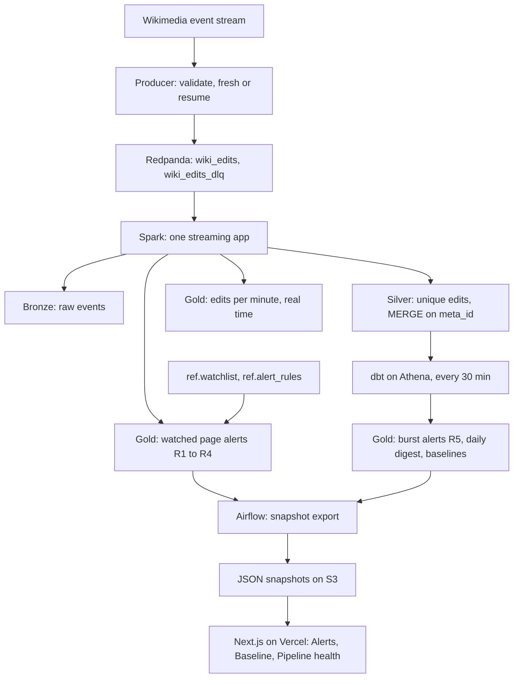

# WikiWatch: real-time brand page monitoring on a streaming lakehouse

[](https://github.com/advaithvemurisai/wikiwatch/actions/workflows/ci.yml)

**Live dashboard: [wikiwatch-kappa.vercel.app](https://wikiwatch-kappa.vercel.app)**

Communications teams find out about risky Wikipedia edits hours late. WikiWatch streams
every Wikimedia edit, checks it against a watchlist of brand pages, and raises an alert
within minutes, with no lost or duplicated edits across restarts.

Redpanda (Kafka API) → Spark Structured Streaming → Apache Iceberg on S3 → dbt on Athena
→ Next.js on Vercel. Deployed with Terraform, tested end to end in CI, and run in short
sessions so it costs cents, not dollars.

## The problem

Wikipedia content flows into search results, knowledge panels and AI assistants, so a bad
edit on a brand page spreads well beyond Wikipedia. A (fictional) consumer goods company,
Brightline Brands, has a 4-person communications team that checks its key pages by hand
about once a day. Vandalism, large removals or a page being moved can sit unnoticed for
hours, and nobody can quickly say what changed, by what kind of account, or whether the
activity is normal for that page.

WikiWatch watches 60 real English Wikipedia company and product pages. Unilever and its
brands stand in for Brightline's own brand and products, and other consumer goods
companies stand in as competitors. No biographies of living people are watched.

| User | Question | Page |
| --- | --- | --- |
| Communications analyst | Did a watched page just get a risky edit? | Alerts |
| Communications lead | Is this a spike on our page, or a busy day on Wikipedia? | Baseline |
| Data engineer | Can the alerts be trusted right now? | Pipeline health |

## Alert rules

| Rule | Fires when | Severity | Computed in |
| --- | --- | --- | --- |
| R1 Page deleted or moved | A delete or move log event on a watched page (restores excluded) | High | Spark, per edit |
| R2 Large removal | At least 2,000 bytes or more than 20% of the page removed | Medium, High with R3 | Spark, per edit |
| R3 Unregistered editor | An IP or temporary account edits the page | Low | Spark, per edit |
| R4 Protection change | A protect log event on a watched page | Low | Spark, per edit |
| R5 Edit burst | 5 or more edits on one page within 10 minutes | Medium | dbt, every 30 min |

Thresholds live in a reference table, so they change without a code deploy: the stream
picks them up from the next micro-batch. Bots never raise R2 or R3. The dashboard shows the
editor type (registered, unregistered, bot), never an IP address.

## Architecture



Per-edit rules need only the edit and the watchlist, so they run in the stream and meet
the 5-minute target. Burst detection needs counts across many edits, so it runs in dbt
every 30 minutes; that trade-off keeps the Spark app small.

The public site never queries Athena. Airflow exports small, schema-checked JSON snapshots
after each dbt run, and Next.js reads them from S3. Page views cost nothing, bots cannot run
up a bill, and the site keeps working after the compute stack is destroyed, with a
"Pipeline offline since ..." banner.

## How it stays correct

- **No lost edits.** The producer saves its stream position to S3 every 30 seconds and
  resumes from it after any stop. It is at-least-once on purpose: a crash can repeat
  events, never skip one.
- **No duplicates.** Silver is an insert-only `MERGE` on the event ID, pruned to the hours
  in each micro-batch. Every alert has a deterministic `alert_id`, so reprocessing never
  creates a second alert.
- **Independent reconciliation.** A dbt test re-implements rules R1 to R4 in SQL,
  separately from the Spark code, and fails if any matching edit in Silver has no alert
  ([`dbt/tests/assert_every_rule_match_has_an_alert.sql`](dbt/tests/assert_every_rule_match_has_an_alert.sql)).
- **End-to-end replay in CI.** Every pull request replays a recorded, privacy-scrubbed
  fixture of about 5,000 events through the real pipeline on a throwaway stack: producer,
  Redpanda, Spark, Iceberg, Trino and dbt. It checks the exact alert IDs, one rejected
  event, unique Silver rows, per-minute window counts, the dashboard export, and, with
  `EXPLAIN`, that every partitioned table scan is pruned.
- **A data contract for the dashboard.** Each snapshot carries a `schema_version` and is
  validated against a JSON Schema when Airflow writes it and again when the site reads it.
  A snapshot the site does not understand shows a friendly message, never a crash.

## Cost and security

- Compute exists only during a session: one t4g.xlarge, created by a GitHub Actions
  workflow and destroyed after. It shuts itself down after 4 hours, and a nightly workflow
  removes anything left. There is no NAT gateway, no Elastic IP and no managed Kafka.
- A $50 AWS budget blocks new instance launches automatically, and an alarm watches how
  much data Athena scans per day. Every Athena query is partition-pruned.
- No AWS keys exist anywhere. GitHub Actions and Vercel reach AWS through OIDC roles that
  trust only this repository and the production site. Secrets live in SSM Parameter
  Store, and CI logs show only resource names and masked errors.
- gitleaks runs before every commit and in CI over the full history.

## Measured so far

| What | Result | How it was measured |
| --- | --- | --- |
| Wikimedia event rate | p50 about 42 events/s, peak about 50 | 18-minute live sample, 30-second windows |
| Resume after killing the producer | 0 events missing; 677 repeats, which Silver deduplicates | live run, checked against an independent recording of the same stream |
| Time to detect, per-edit alerts | p95 about 61 seconds | scripted edit scenario on the local stack |
| End-to-end replay test | exact alerts, 0 duplicates, all scans pruned | every pull request, about 5 minutes in CI |
| Tests | 396 Python tests, 31 web tests, 24 dbt data tests | `make test`, `make web-check`, `make dbt-build` |
| First AWS session | producer at about 33 events/s; Spark writing Bronze, Silver and Gold to S3 and Glue | 2026-10-05 |

Still to measure on AWS: p95 time to detect over a full 3-hour session (target under 5
minutes) and total v1 spend (target under $10).

## Run it locally

Requirements: Docker Desktop (memory set to 6 GB), Python 3.13, Node 24, make. On an 8 GB
machine, run the core stack plus at most one extra profile.

```bash
make venv        # Python dev tools
make env-local   # .env.local with random throwaway local secrets
make up-dbt      # Redpanda, SeaweedFS, Iceberg REST catalog, Spark, Trino
make smoke       # Spark writes an Iceberg table, Trino reads it back
make e2e         # the full replay test on a throwaway stack (stop the dev stack first)
make web         # the dashboard on fixture snapshots, at http://localhost:3000
```

To stream live edits, add a User-Agent with your contact details to `.env.local`
(`WIKIWATCH_USER_AGENT=WikiWatch/0.1 (<your contact URL>)`, as Wikimedia requires), then
run `make produce MODE=fresh` the first time and `make produce MODE=resume` after any stop.

| Command | What it does |
| --- | --- |
| `make up` / `make up-airflow` / `make down` | Core stack, core plus Airflow, stop |
| `make test` / `make lint` / `make secrets-check` | Unit and contract tests, linters, gitleaks |
| `make check-lake` | Silver duplicates, Bronze offset gaps, Bronze-to-Silver completeness |
| `make alert-scenario` | Replay scripted edits; exact expected alerts and detection latency |
| `make dbt-build` | dbt models and every dbt test on local Trino |
| `make load-ref` | Reload the watchlist and alert thresholds into the running stream |
| `make maintain-lake` | Compact small files and expire old snapshots (start of a session) |
| `make web-s3` / `make web-check` | Dashboard on local S3 snapshots / type check, lint, tests, build |

| Local UI | Address |
| --- | --- |
| Dashboard (`make web`) | http://localhost:3000 |
| Redpanda Console | http://localhost:8088 |
| Airflow (`make up-airflow`) | http://localhost:8080 |
| Trino (`make up-dbt`) | http://localhost:8085 |

## Run it on AWS

A one-time setup from AWS CloudShell creates the state bucket and the persistent
foundation ([docs/first-apply-checklist.md](docs/first-apply-checklist.md)). After that,
sessions start and stop from GitHub Actions: **demo-up** with a release tag, **demo-down**
when done. The Vercel side is in [docs/vercel-setup.md](docs/vercel-setup.md).

## Repository layout

| Path | Contents |
| --- | --- |
| `producer/` | Wikimedia event stream client: validation, dead-letter queue, fresh and resume modes |
| `streaming/` | The Spark application: Bronze, Silver, real-time windows, alerts |
| `dbt/` | Gold models, seeds (watchlist, alert rules) and data tests |
| `orchestration/`, `airflow/` | Snapshot export and health queries, the two DAGs |
| `schemas/` | Event schema and the dashboard snapshot contract |
| `web/` | The Next.js dashboard |
| `infra/` | Terraform: bootstrap, foundation and compute stacks |
| `tests/` | Contract, infrastructure and workflow tests, and the end-to-end replay test |

## Design documents

- [docs/v1.md](docs/v1.md): v1 scope, business story, alert rules, data model
- [docs/plan.md](docs/plan.md): full technical design
- [docs/adr/](docs/adr/): 11 architecture decision records, from Airflow 3 to the dashboard
  snapshot contract
