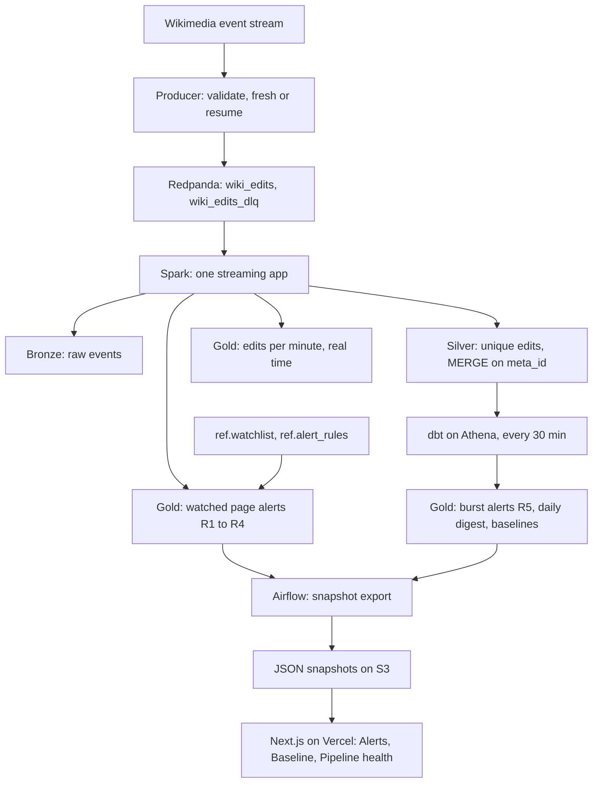
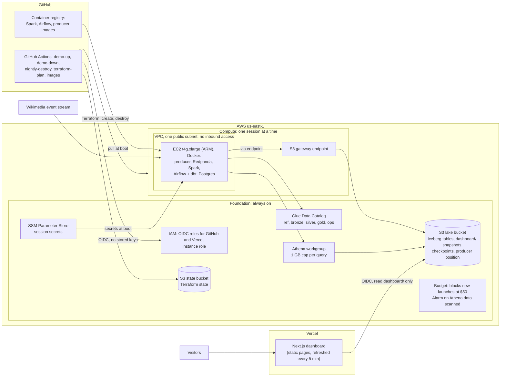

# WikiWatch: real-time brand page monitoring on a streaming lakehouse

[](https://github.com/advaithvemurisai/wikiwatch/actions/workflows/ci.yml)

**Live dashboard: [wikiwatch-kappa.vercel.app](https://wikiwatch-kappa.vercel.app)**

Communications teams find out about risky Wikipedia edits hours late. WikiWatch streams
every Wikimedia edit, checks it against a watchlist of brand pages, and raises an alert
within minutes, with no lost or duplicated edits across restarts.

Redpanda (Kafka API) → Spark Structured Streaming → Apache Iceberg on S3 → dbt on Athena
→ Next.js on Vercel. Deployed with Terraform from GitHub Actions, tested end to end in CI,
and run on AWS in short sessions, so it costs cents, not dollars.

## The problem

Wikipedia content flows into search results, knowledge panels and AI assistants, so a bad
edit on a brand page spreads well beyond Wikipedia. A (fictional) consumer goods company,
Brightline Brands, has a 4-person communications team that checks its key pages by hand
about once a day. Vandalism, large removals or a page being moved can sit unnoticed for
hours, and nobody can quickly say what changed, by what kind of account, or whether the
activity is normal for that page.

WikiWatch watches 60 real English Wikipedia company and product pages. Unilever and its
brands stand in for Brightline's own brand and products, and other consumer goods
companies stand in as competitors. No biographies of living people are watched.

| User | Question | Page |
| --- | --- | --- |
| Communications analyst | Did a watched page just get a risky edit? | Alerts |
| Communications lead | Is this a spike on our page, or a busy day on Wikipedia? | Baseline |
| Data engineer | Can the alerts be trusted right now? | Pipeline health |

## Alert rules

| Rule | Fires when | Severity | Computed in |
| --- | --- | --- | --- |
| R1 Page deleted or moved | A delete or move log event on a watched page (restores excluded) | High | Spark, per edit |
| R2 Large removal | At least 2,000 bytes or more than 20% of the page removed | Medium, High with R3 | Spark, per edit |
| R3 Unregistered editor | An IP or temporary account edits the page | Low | Spark, per edit |
| R4 Protection change | A protect log event on a watched page | Low | Spark, per edit |
| R5 Edit burst | 5 or more edits on one page within 10 minutes | Medium | dbt, every 30 min |

Thresholds live in a reference table, so they change without a code deploy: the stream
picks them up from the next micro-batch. Bots never raise R2 or R3. The dashboard shows the
editor type (registered, unregistered, bot), never an IP address.

## Data flow



Per-edit rules need only the edit and the watchlist, so they run in the stream and meet
the 5-minute target. Burst detection needs counts across many edits, so it runs in dbt
every 30 minutes; that trade-off keeps the Spark app small.

The public site never queries Athena. Airflow exports small, schema-checked JSON snapshots
after each dbt run, and Next.js reads them from S3. Page views cost nothing, bots cannot run
up a bill, and the site keeps working after the compute stack is destroyed, with a
"Pipeline offline since ..." banner.

## AWS architecture

Everything runs in one region (us-east-1) and is defined in Terraform as three stacks:
**bootstrap** (the state bucket), **foundation** (always on, costs cents a month) and
**compute** (created for a session and destroyed after).



**A session, start to finish**

1. **demo-up** (GitHub Actions, run by hand with a release tag) assumes the deploy role
   through OIDC and applies the compute stack: a VPC with one public subnet, an internet
   gateway, an S3 gateway endpoint, a security group with no inbound rules, and one
   t4g.xlarge. If AWS has no spare capacity, it retries in another zone, then as on-demand.
2. **The instance boots itself** (about 5 to 10 minutes). It arms a 4-hour self-shutdown
   first, so a forgotten session always stops. Then it installs Docker, checks out the
   release tag, reads its secrets from SSM, pulls the release's prebuilt images (or builds
   them), and starts Redpanda, Spark, Airflow and Postgres.
3. **A boot check proves the cloud path** before the session is used: both DAGs are
   scheduled, one run of each succeeds (Athena, Glue, dbt on Athena, the S3 export), and the
   dbt unit tests pass on Athena. The result is in the boot log.
4. **You connect with SSM Session Manager** (no SSH, no open port) and start the producer
   in `resume` mode, so it continues exactly where the last session stopped.
5. **The pipeline runs itself.** Spark writes Bronze, Silver and Gold every minute;
   `freshness_monitor` updates the health snapshot every 5 minutes; `dbt_gold` rebuilds
   Gold and exports the alert and baseline snapshots every 30 minutes.
6. **demo-down** destroys the compute stack. If nobody runs it, the instance terminates
   itself after 4 hours and **nightly-destroy** removes the rest. The lake, the catalog and
   the dashboard stay, and the site shows the last session.

**Why each service**

| Need | Service | Why this one |
| --- | --- | --- |
| Stream processing | Spark on one EC2 instance, only during sessions | No always-on cluster to pay for; the same Docker setup runs on the laptop |
| Kafka | Redpanda in Docker on the instance | Kafka API without a managed cluster; nothing depends on it surviving a session |
| Lake storage | S3 with Apache Iceberg tables | Cheap, durable, and the tables outlive every session |
| Table catalog | Glue Data Catalog | Serverless, and Athena reads it directly |
| SQL for dbt and the export | Athena | Pay per query, partition-pruned, with a 1 GB cap per query |
| Secrets | SSM Parameter Store | Encrypted, read once at boot, never on a laptop or in the repo |
| Access from GitHub and Vercel | IAM roles through OIDC | Short-lived credentials; no access keys exist anywhere |
| Cost control | Budget with an automatic action, Athena alarm | Spending is capped by AWS itself, not by remembering to stop |

There is deliberately no NAT gateway, no Elastic IP, no load balancer, no managed Kafka and
no EMR: each would cost more per month than all of v1.

## How it stays correct

- **No lost edits.** The producer saves its stream position to S3 every 30 seconds and
  resumes from it after any stop. It is at-least-once on purpose: a crash can repeat
  events, never skip one.
- **No duplicates.** Silver is an insert-only `MERGE` on the event ID, pruned to the hours
  in each micro-batch. Every alert has a deterministic `alert_id`, so reprocessing never
  creates a second alert.
- **Independent reconciliation.** A dbt test re-implements rules R1 to R4 in SQL,
  separately from the Spark code, and fails if any matching edit in Silver has no alert
  ([`dbt/tests/assert_every_rule_match_has_an_alert.sql`](dbt/tests/assert_every_rule_match_has_an_alert.sql)).
- **End-to-end replay in CI.** Every pull request replays a recorded, privacy-scrubbed
  fixture of about 5,000 events through the real pipeline on a throwaway stack: producer,
  Redpanda, Spark, Iceberg, Trino and dbt. It checks the exact alert IDs, one rejected
  event, unique Silver rows, per-minute window counts, the dashboard export, and, with
  `EXPLAIN`, that every partitioned table scan is pruned.
- **A data contract for the dashboard.** Each snapshot carries a `schema_version` and is
  validated against a JSON Schema when Airflow writes it and again when the site reads it.
  Snapshots export independently, so one failure never blanks the site: the page keeps
  its last good data and says the latest export failed.
- **Checked in the cloud at every boot.** The boot check above runs the cloud-only path
  (Athena, Glue, dbt on Athena, the S3 export) at the start of every session.

## Cost and security

- Compute exists only during a session, and every exit path ends it: demo-down, the
  instance's own 4-hour shutdown, and nightly-destroy.
- A $50 AWS budget blocks new instance launches automatically, with email alerts at $10,
  $25 and $40, and an alarm fires if Athena scans more than 20 GB in a day.
- No AWS keys exist anywhere. GitHub Actions and Vercel reach AWS through OIDC roles that
  trust only this repository and the production site: pull requests get a read-only plan
  role, `main` gets the deploy role, and Vercel can only read `dashboard/`.
- The instance has no inbound access at all; it is reached through SSM Session Manager.
  Its role reads only WikiWatch's own parameters.
- CI logs show only resource names and masked errors, never Terraform's full output.
  gitleaks runs before every commit and in CI over the full history.

## Measured so far

| What | Result | How it was measured |
| --- | --- | --- |
| Wikimedia event rate | p50 about 42 events/s, peak about 50 | 18-minute live sample, 30-second windows |
| Resume after killing the producer | 0 events missing; 677 repeats, which Silver deduplicates | live run, checked against an independent recording of the same stream |
| Time to detect, per-edit alerts | p95 about 61 seconds | scripted edit scenario on the local stack |
| End-to-end replay test | exact alerts, 0 duplicates, all scans pruned | every pull request, about 5 minutes in CI |
| AWS sessions | about 600,000 and 1,030,000 edits received; first session: all 599,230 Bronze events unique, so 0 duplicates; dbt on Athena 23 of 23 passing | first two sessions, 2026-10-05 |
| Tests | 424 Python tests, 40 web tests, 25 dbt unit and data tests | `make test`, `make web-check`, `make dbt-build` |

Still to measure on AWS: p95 time to detect over a full 3-hour session (target under 5
minutes) and total v1 spend (target under $10).

## Run it locally

Requirements: Docker Desktop (memory set to 6 GB), Python 3.13, Node 24, make. On an 8 GB
machine, run the core stack plus at most one extra profile.

```bash
make venv        # Python dev tools
make env-local   # .env.local with random throwaway local secrets
make up-dbt      # Redpanda, SeaweedFS, Iceberg REST catalog, Spark, Trino
make smoke       # Spark writes an Iceberg table, Trino reads it back
make e2e         # the full replay test on a throwaway stack (stop the dev stack first)
make web         # the dashboard on fixture snapshots, at http://localhost:3000
```

Locally, SeaweedFS stands in for S3, an Iceberg REST catalog for Glue, and Trino for
Athena; the same code runs against both, and only the env file changes.

To stream live edits, add a User-Agent with your contact details to `.env.local`
(`WIKIWATCH_USER_AGENT=WikiWatch/0.1 (<your contact URL>)`, as Wikimedia requires), then
run `make produce MODE=fresh` the first time and `make produce MODE=resume` after any stop.

| Command | What it does |
| --- | --- |
| `make up` / `make up-airflow` / `make down` | Core stack, core plus Airflow, stop |
| `make test` / `make lint` / `make secrets-check` | Unit and contract tests, linters, gitleaks |
| `make check-lake` | Silver duplicates, Bronze offset gaps, Bronze-to-Silver completeness |
| `make alert-scenario` | Replay scripted edits; exact expected alerts and detection latency |
| `make dbt-build` | dbt models and every dbt test on local Trino |
| `make load-ref` | Reload the watchlist and alert thresholds into the running stream |
| `make maintain-lake` | Compact small files and expire old snapshots (start of a session) |
| `make boot-check` | Both DAGs scheduled, one run of each succeeds, dbt unit tests pass |
| `make web-s3` / `make web-check` | Dashboard on local S3 snapshots / type check, lint, tests, build |

| Local UI | Address |
| --- | --- |
| Dashboard (`make web`) | http://localhost:3000 |
| Redpanda Console | http://localhost:8088 |
| Airflow (`make up-airflow`) | http://localhost:8080 |
| Trino (`make up-dbt`) | http://localhost:8085 |

## Run it on AWS

A one-time setup from AWS CloudShell creates the state bucket and the foundation, and
connects GitHub and Vercel
([docs/first-apply-checklist.md](docs/first-apply-checklist.md),
[docs/vercel-setup.md](docs/vercel-setup.md)). After that, a session is three steps:

1. **Start it.** Run **demo-up** in GitHub Actions with a release tag (market `spot` or
   `on-demand`; set a zone only to retry after a capacity shortage). The instance boots
   itself in about 7 to 10 minutes; the boot log ends with `BOOT CHECK PASSED`.
2. **Start the producer.** From CloudShell, open a session on the instance (its ID is in the
   demo-up log), then run the producer from the repo directory. The AWS env file is not the
   default, so pass it every time:

   ```bash
   aws ssm start-session --target <instance-id> --region us-east-1
   cd /opt/wikiwatch
   sudo tail -n 40 /var/log/wikiwatch-boot.log                 # expect "boot check passed"
   sudo make produce ENV_FILE=.env.aws MODE=resume             # first ever session: MODE=fresh
   sudo make producer-logs ENV_FILE=.env.aws                   # Ctrl+C leaves the view only
   ```

   `resume` replays everything Wikimedia published since the last session ended. After a
   gap of a day or two, expect about 40 minutes of catch-up at 2,000+ events/s while Spark
   runs behind (`Current batch is falling behind` warnings are normal). The producer is live
   when `events_per_sec` drops to about 30 and `last_event_dt` matches `ts`.
3. **Stop it.** Run **demo-down** when done. If you forget, the instance stops itself after
   4 hours and nightly-destroy removes the rest.

To check health from CloudShell, read `dashboard/v1/health.json` in the lake bucket: its
`generated_at` should be under 5 minutes old and `lag` near zero. The instance has no AWS
CLI, so run `aws` commands from CloudShell, not inside the session.

## Repository layout

| Path | Contents |
| --- | --- |
| `producer/` | Wikimedia event stream client: validation, dead-letter queue, fresh and resume modes |
| `streaming/` | The Spark application: Bronze, Silver, real-time windows, alerts, lake maintenance |
| `dbt/` | Gold models, seeds (watchlist, alert rules), unit and data tests |
| `orchestration/`, `airflow/` | Snapshot export and health queries, the two DAGs, the boot check |
| `schemas/` | Event schema and the dashboard snapshot contract |
| `web/` | The Next.js dashboard |
| `infra/` | Terraform: bootstrap, foundation and compute stacks |
| `.github/workflows/` | CI, Terraform plan, session start and stop, nightly destroy, image publishing |
| `tests/` | Contract, infrastructure and workflow tests, and the end-to-end replay test |

## Design documents

- [docs/v1.md](docs/v1.md): v1 scope, business story, alert rules, data model
- [docs/plan.md](docs/plan.md): full technical design
- [docs/adr/](docs/adr/): 12 architecture decision records, from Airflow 3 to the dashboard
  snapshot contract and session start
