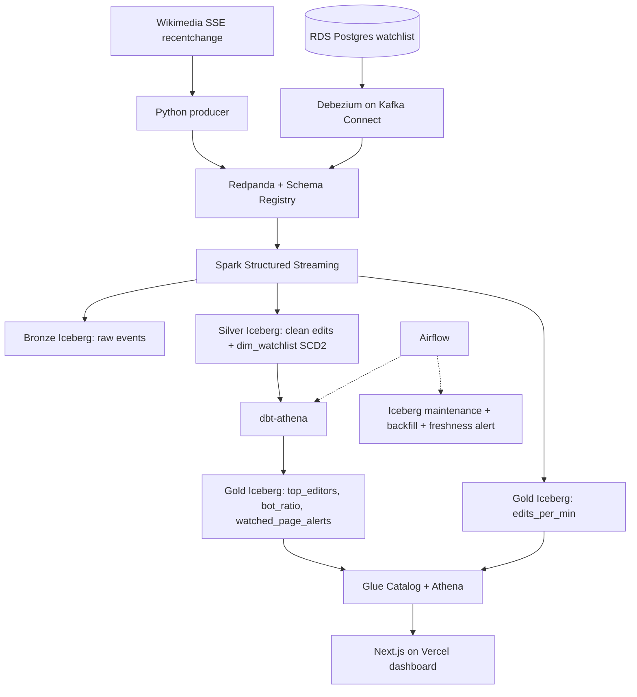

# Wikipedia Real-Time Edit Analytics - Project Plan

Sep 25, 2026 · Advaith

This is the full technical design across v1, v2 and v3. While building v1, `docs/v1.md` wins where the two differ.

## Overview

Build one streaming lakehouse on AWS that ingests live Wikipedia edits, proves correctness under failure, and stays under $50 of the $100 AWS credits. The project favors depth over tool count: every component must have a clear reason to exist and a documented failure mode.

**What it proves to a hiring manager**

- Real streaming: event-time windows, watermarks, late data, dedup, checkpoint recovery
- Two ingestion patterns: a native event stream (SSE) and database CDC (Debezium)
- Lakehouse engineering: Iceberg medallion layers, table maintenance, replayable backfills
- Production habits: schema contracts, IaC, CI with an end-to-end replay test, cost control
- Judgment: written architecture decisions and a failure-mode analysis

**Target roles:** Data Engineer, Analytics Engineer (streaming-heavy teams), Data Platform Engineer.

**Constraints:** developed on an M1 MacBook Air, deployed to AWS only for demo sessions and one soak test, funded by the AWS new-account credits.

## Architecture

Two sources feed Redpanda, Spark writes Iceberg Bronze and Silver plus real-time Gold windows, dbt builds analytical Gold on Athena, and a Next.js app on Vercel serves it.



**End-to-end flow**

1. The producer reads the Wikimedia SSE stream, validates each event against the registered schema, and publishes to `wiki_edits` keyed by page.
2. Debezium captures inserts, updates and deletes on the `watchlist` table and publishes to `cdc_watchlist`.
3. Spark reads both topics. It writes raw events to Bronze, deduped and typed edits to Silver, applies watchlist changes as an SCD2 dimension, and computes 1-minute event-time windows into `gold.edits_per_min`.
4. Airflow runs dbt-athena on a schedule to build the remaining Gold models and their tests.
5. Athena queries Gold through the Glue Catalog. The last step of the `dbt_gold` DAG exports small JSON snapshots for the dashboard to a private S3 prefix, and the Next.js app on Vercel reads only those snapshots.
6. Airflow also runs table maintenance, backfills, and a freshness check that alerts Slack.

**Durable vs ephemeral state**

The compute stack is destroyed after every session, so Redpanda, its topics, Kafka Connect offsets and the schema registry are ephemeral. Durability comes from two places only: Wikimedia's own stream history upstream, and S3 downstream. Every design choice below follows from this.

| State | Lives in | Survives destroy? | How a new session recovers |
| --- | --- | --- | --- |
| Wikimedia stream position | `s3://<lake>/state/producer/last_event_id` (written every 30 s) | Yes | Producer resumes from it (`resume` mode) or starts at now (`fresh` mode) |
| Redpanda topics and offsets | EBS on EC2 | No | Recreated empty; nothing downstream depends on old offsets |
| Spark checkpoints | `s3://<lake>/_checkpoints/<session_id>/<query>` | Yes, but never reused | Each session gets a new `session_id`; correctness comes from idempotent MERGE on `meta_id`, not from checkpoints |
| Schema registry | Redpanda internal topic | No | Schemas re-registered from `schemas/` in git at startup; compatibility is enforced in CI against git history |
| Watchlist source data | RDS | No | `demo-down` dumps the table to S3; `demo-up` restores it before Debezium starts |
| Debezium offsets | Redpanda internal topic | No | Every session starts with an initial snapshot; SCD2 hash comparison prevents false versions |
| Bronze, Silver, Gold, ops | S3 + Glue | Yes | Nothing to do |

Use `resume` mode after short gaps (a crash, a spot interruption, a drill) so no events are lost. Use `fresh` mode after gaps of days, which are documented as gaps rather than backfilled, to keep sessions cheap and fast.

**Conventions:** all timestamps are UTC; all partitions use UTC dates and hours.

## Tech stack and decisions

Each choice below becomes an Architecture Decision Record (ADR) in the repo.

| Layer | Choice | Why | Rejected alternative |
| --- | --- | --- | --- |
| Source (stream) | Wikimedia EventStreams SSE | Free, no API key, genuinely real-time, high volume | Simulated taxi replay (not real streaming) |
| Source (CDC) | RDS Postgres + Debezium | Standard log-based CDC on a managed DB | Postgres in Docker (skips RDS replication config) |
| Broker | Redpanda + built-in Schema Registry | Kafka API, single binary, light on RAM, ARM native | MSK (cost), Kafka + ZooKeeper (heavy) |
| Stream processing | Spark Structured Streaming, local mode on EC2 | Industry-standard, native Iceberg sink, event-time windows | Flink (smaller hiring signal), EMR (cost) |
| Table format | Apache Iceberg v2 | Native Athena read/write, MERGE, OPTIMIZE, Glue support | Delta Lake (weaker Athena support on AWS) |
| Catalog | AWS Glue Data Catalog | Shared by Spark and Athena, near-free | Hive metastore (extra service) |
| Batch transforms | dbt-athena (dbt-trino on a local Trino for dev) | Works directly on Iceberg, serverless | dbt-spark (needs a Thrift server) |
| Query engine | Athena | Serverless, pay per TB scanned | Trino on EC2 (more to operate) |
| Orchestration | Airflow (Docker on EC2) | Most common in job postings | MWAA (cost), Dagster (fine, less common) |
| Dashboard | Next.js on Vercel (Hobby plan) | Free hosting, polished UI, reads precomputed JSON from S3 through OIDC, so page views never touch Athena | Streamlit (less control over the UI), Metabase on EC2 (not always-on) |
| IaC | Terraform, two stacks | Separates persistent data from ephemeral compute | Single stack (destroy risks the lake) |
| CI/CD | GitHub Actions with AWS OIDC | No stored AWS keys | Long-lived IAM keys |
| Data quality | dbt tests + schema registry compatibility | Covers contracts and model checks with no extra tool | Great Expectations (tool overhead) |

**Local parity:** SeaweedFS, an Iceberg REST catalog and Trino locally mirror S3, Glue and Athena in the cloud. Athena engine v3 is Trino-based, so dbt models are tested in the dialect they run in; Spark's catalog and the dbt target switch by environment file. Start Trino only when working on dbt, to spare the Mac's memory.

## Data model

Two topics feed three Iceberg layers; every table is partitioned by event date (and hour for high-volume tables).

**Topics**

| Topic | Key | Schema (registry subject) | Retention |
| --- | --- | --- | --- |
| `wiki_edits` | `wiki` + `title` (page) | `wiki_edits-value`, JSON Schema, BACKWARD compatible | 7 days |
| `cdc_watchlist` | `watch_id` | Debezium envelope | 7 days |
| `wiki_edits_dlq` | original key | raw payload + error reason | 14 days |
| `ops_metrics` | component name | `ops_metrics-value`, JSON Schema | 3 days |

**Tables**

| Layer | Table | Grain | Key fields | Written by |
| --- | --- | --- | --- | --- |
| Bronze | `bronze.wiki_edits_raw` | one row per received event (duplicates kept) | `meta_id`, raw JSON, `ingested_at`, Kafka partition and offset | Spark |
| Bronze | `bronze.watchlist_cdc_raw` | one row per CDC event | Debezium `op`, before/after, `ts_ms` | Spark |
| Bronze | `bronze.wiki_edits_dlq` | one row per rejected event | raw payload, error reason, `rejected_at` | Spark |
| Silver | `silver.wiki_edits` | one row per unique edit | `meta_id` (unique), `event_ts`, `ingested_at`, `wiki`, `title`, `user`, `is_bot`, `edit_type`, `byte_delta`, `is_late` | Spark (foreachBatch MERGE) |
| Silver | `silver.dim_watchlist` | SCD2, one row per version | `watch_id`, `wiki`, `title`, `owner`, `valid_from`, `valid_to`, `is_current` | Spark (foreachBatch MERGE) |
| Gold | `gold.edits_per_min` | wiki x 1-minute window, real-time | `window_start`, `wiki`, `edits`, `bot_edits`, `bytes_changed` | Spark (append) |
| Gold | `gold.edits_per_min_final` | wiki x 1-minute window, complete | same as above, includes late events | dbt |
| Gold | `gold.top_editors_daily` | user x day | `user`, `edits`, `wikis_touched`, `is_bot` | dbt |
| Gold | `gold.bot_ratio_hourly` | wiki x hour | `bot_share`, `human_edits`, `bot_edits` | dbt |
| Gold | `gold.watched_page_alerts` | one row per edit on a watched page | edit fields + `watch_id`, `owner` (joined as of edit time) | dbt |

**Rules**

- Bronze is append-only and never modified; it is the replay source for every backfill.
- Silver holds business-clean data only; malformed events go to the DLQ topic, not to Silver.
- Gold is always rebuildable from Silver and, transitively, from Bronze.
- Operational metrics live in a separate `ops` database (see the observatory section) and never mix with business tables.

## Streaming design

The guarantee is at-least-once ingestion and effectively-once results in Silver and Gold, stated plainly in the README.

**Producer**

- Connects to the SSE endpoint with a descriptive User-Agent, as Wikimedia requires.
- Two start modes: `resume` (continue from the `Last-Event-ID` stored in S3) and `fresh` (start at now). Reconnects inside a session always resume, with exponential backoff and jitter.
- Writes the latest event ID to S3 every 30 seconds, so a destroyed or reclaimed instance loses nothing it had not yet checkpointed upstream.
- Validates each event against the JSON Schema in `schemas/` and publishes plain JSON (no schema-registry wire format), so Spark can parse it with `from_json`. The registry holds the contract; the producer enforces it. Failures go to `wiki_edits_dlq` with the error reason.
- Uses idempotent producer settings (`acks=all`, `enable.idempotence=true`).
- Emits counters every 30 seconds (received, published, rejected, reconnects) to `ops_metrics`.
- Measure the real event rate in the first session (expected tens of events per second across all wikis) and size partitions, file targets and budgets from that number, not from assumptions.

**Partitioning**

- Key by page (`wiki` + `title`), not by `wiki`: a few projects produce most of the traffic, so keying by `wiki` would create hot partitions.
- 6 partitions on `wiki_edits`; document the skew check (messages per partition) in the soak report.

**Spark job**

- One Spark application hosts all streaming queries (one SparkSession, driver memory about 5 GB), so the 16 GB instance is not split across several JVMs. Maintenance and backfill jobs run as separate short-lived `spark-submit` calls with 2 GB.
- Trigger: 1 minute processing time. Checkpoints on S3 under a per-session path; never reused across sessions (see the state model).
- Silver dedup: `foreachBatch` with an insert-only `MERGE INTO silver.wiki_edits` on `meta_id` (`WHEN NOT MATCHED THEN INSERT`). Iceberg executes insert-only MERGE as an anti-join plus append, so no data files are rewritten. The target is pruned to `event_hour` partitions within the last 3 hours, which covers reconnect and resume overlaps; a daily dbt uniqueness test on `meta_id` catches anything older.
- Late data: `is_late = ingested_at - event_ts > 10 minutes`. Late events land in Silver normally with the flag set.
- Real-time windows: 1-minute tumbling windows per `wiki` with a 2-minute watermark, append output mode straight to `gold.edits_per_min`. Append avoids MERGE rewrites and delete files on the hottest Gold table. Expected latency is 3 to 4 minutes (window, watermark, trigger).
- Reconciliation: events later than the watermark miss the real-time table, so dbt builds `gold.edits_per_min_final` from Silver. The observatory shows the gap between the two as the measured cost of low latency.
- One streaming query per sink so each has its own checkpoint and can be restarted independently.
- Bot flag: the source `bot` field, kept as-is; no heuristic guessing.
- Metrics: a `StreamingQueryListener` buffers progress events in memory and flushes them to S3 every minute; it never writes on the streaming thread.

**Questions an interviewer will ask, answered in the README**

- What happens on a duplicate event? The Silver MERGE ignores it, including overlaps after a resume or a full replay from Bronze.
- What happens on a crash? Within a session, Spark restarts from its checkpoint. If the instance is lost, a new session starts with a new checkpoint and the producer resumes from the S3-stored event ID; the MERGE absorbs the overlap.
- What is the end-to-end latency? Silver in about 1 to 2 minutes, real-time Gold in about 3 to 4 minutes; report measured p50 and p95 from the soak test.
- Why two edits-per-minute tables? The streaming one trades completeness for latency; the dbt one is complete. Showing the difference is the point.

## CDC design

The watchlist is a small Postgres table of pages that users track; its changes flow through Debezium into an SCD2 dimension that powers `gold.watched_page_alerts`.

**Source table**

`watchlist(watch_id PK, wiki, title, owner, alert_threshold_bytes, created_at, updated_at)`, seeded with about 500 rows of popular pages, plus a small script that randomly inserts, updates and deletes rows during a session to generate CDC traffic.

**RDS setup (in Terraform)**

- Custom parameter group with `rds.logical_replication = 1`; this requires a reboot, so it is set at creation.
- A dedicated replication user with only the replication role and SELECT on `watchlist`.
- Debezium Postgres connector using `pgoutput` and a named publication for `watchlist` only.

**Processing**

- Spark reads `cdc_watchlist` and uses `foreachBatch` with an Iceberg `MERGE INTO` to maintain `silver.dim_watchlist` as SCD2.
- Handles all Debezium operations: `r` (snapshot read), `c`, `u`, `d`. Deletes close the current version (`valid_to` set, `is_current = false`).
- Because RDS is recreated each session, each run starts with a snapshot. Snapshot rows for unchanged records must not create new SCD2 versions: compare a hash of tracked columns before opening a version.

**Session persistence:** RDS is destroyed with the compute stack, so the watchlist would reset to its seed every session and SCD2 would record false reversions. `demo-down` exports the table to `s3://<lake>/state/watchlist/` before destroying; `demo-up` restores it before Debezium starts. The seed script runs only when no export exists.

**Replication slot risk**

If Debezium stops while RDS keeps running, the replication slot retains WAL and the disk fills. Mitigations: set `max_slot_wal_keep_size`, alert on slot lag in the freshness DAG, and drop the slot as part of the demo-down workflow. Document this in the failure-mode table.

## Iceberg table maintenance

A 1-minute trigger produces about 1,440 commits per table per day, so maintenance is a scheduled job, not an afterthought.

| Task | Method | Schedule | Scope |
| --- | --- | --- | --- |
| Compact small files | Spark `rewrite_data_files` (binpack, 128 MB target) | Hourly | Closed hour partitions only |
| Expire snapshots | `expire_snapshots`, keep 24 hours | Daily | All tables |
| Remove orphan files | `remove_orphan_files`, older than 3 days | Weekly | All tables |
| Rewrite manifests | `rewrite_manifests` | Daily | Streaming tables |

**Avoiding commit conflicts:** compaction only touches partitions the stream no longer writes to (hour older than the current hour minus the watermark). Record before and after file counts and average file size in the soak report.

Table properties to set at creation: `format-version = 2`, `write.target-file-size-bytes`, `write.metadata.delete-after-commit.enabled = true`, `write.metadata.previous-versions-max = 100`.

## Orchestration

Airflow runs four DAGs; streaming jobs run as long-lived containers, not as Airflow tasks.

| DAG | Schedule | Tasks | Success criteria |
| --- | --- | --- | --- |
| `dbt_gold` | Every 30 minutes (incremental, partition-pruned) | `dbt build --select gold` (models + tests) on dbt-athena, then export dashboard JSON snapshots to S3 | All tests pass; failure alerts Slack |
| `iceberg_maintenance` | Hourly (compaction), daily and weekly (cleanup) | Tasks from the maintenance table above | File count per partition drops after compaction |
| `backfill` | Manual, params `start_date`, `end_date` | Rebuild Silver from Bronze for the range, then Gold via dbt | Row counts and aggregates match the pre-backfill snapshot |
| `freshness_monitor` | Every 5 minutes | Check max `event_ts` in Silver, Redpanda consumer lag, replication slot lag | Alert Slack if Silver is older than 5 minutes or slot lag grows |

All DAGs are idempotent: rerunning any task for the same interval produces the same result.

## Web app: pipeline observatory

The app shows how the data was produced, not just what it says: six of its seven pages are about the pipeline, and only one is business analytics.

**Core rule:** every metric is persisted to S3. The last step of the `dbt_gold` DAG queries Athena and exports one small JSON snapshot per page to a private S3 prefix, and the app reads only those snapshots. The app never calls Redpanda, Spark or Airflow directly, so it keeps working after `demo-down` and shows a banner: "Pipeline offline since <time>, showing last session".

**Storage choice for ops data:** ops tables are append-only JSON Lines files on S3 under `s3://<lake>/ops/<table>/dt=YYYY-MM-DD/`, registered as Glue external tables with partition projection (no crawler, no MSCK). They are not Iceberg: listeners and callbacks write small records every minute, and Iceberg would turn that into thousands of tiny commits a day with no benefit, since ops data is never updated.

**Pages**

| Page | What it shows | Data source |
| --- | --- | --- |
| 1. Pipeline overview | Architecture diagram with per-stage status (green, amber, red), freshness per layer, throughput per stage, record funnel per ingestion hour: received, published, Bronze, Silver (after dedup), DLQ | `ops.stream_progress`, `ops.producer_metrics`, layer row counts |
| 2. Streaming health | Consumer lag per partition, partition skew, watermark position over time, micro-batch duration, late events per hour, end-to-end latency p50/p95 (event time, ingest time, Silver write), real-time vs final edits-per-minute gap | `ops.stream_progress`, `ops.lag_snapshots`, Silver timestamps, `gold.edits_per_min` vs `gold.edits_per_min_final` |
| 3. Data quality and contracts | Duplicates ignored, DLQ volume by error reason, schema versions from the registry, dbt test pass/fail history, Bronze vs Silver vs Gold reconciliation | `bronze.wiki_edits_dlq`, `ops.schema_versions`, `ops.dbt_test_results` |
| 4. Lakehouse internals | Snapshot history, file count and average file size per partition, before/after compaction, time-travel comparisons for the last 10 snapshots, precomputed by the export step | Iceberg metadata tables via Athena (`$snapshots`, `$files`, `$partitions`), `ops.maintenance_log` |
| 5. CDC | Debezium op counts (r, c, u, d), SCD2 version history for any watched page, replication slot lag | `bronze.watchlist_cdc_raw`, `silver.dim_watchlist`, `ops.lag_snapshots` |
| 6. Orchestration and recovery | DAG run history (status, duration), backfill runs with before/after comparison, recovery drills with detection and recovery times | `ops.dag_runs`, `ops.backfill_log`, `ops.incidents` |
| 7. Analytics | Edits per minute by wiki, bot share, top editors, watched page alerts | Gold tables |

**How the ops tables are populated**

| Ops table | Written by | Frequency |
| --- | --- | --- |
| `ops.stream_progress` | Spark `StreamingQueryListener` (buffered, flushed to S3) | Every micro-batch, flushed each minute |
| `ops.producer_metrics` | Producer publishes counters to `ops_metrics`; a small Spark query lands them | Every 30 seconds |
| `ops.lag_snapshots` | `freshness_monitor` DAG: consumer lag per partition, replication slot lag | Every 5 minutes |
| `ops.schema_versions` | `freshness_monitor` DAG reads registry subjects and versions | Every 5 minutes (only on change) |
| `ops.dbt_test_results` | `dbt_gold` DAG parses `run_results.json` | Every dbt run |
| `ops.maintenance_log` | `iceberg_maintenance` DAG: file counts and sizes before and after | Every maintenance run |
| `ops.backfill_log` | `backfill` DAG: row counts and aggregate checksums before and after | Every backfill |
| `ops.dag_runs` | Airflow success and failure callbacks | Every DAG run |
| `ops.incidents` | `make drill` script: kills a component, records the time; detection and recovery times computed from `ops.lag_snapshots` and `ops.stream_progress` | Each drill |

Silver rows also carry `processed_at` (MERGE commit time) so page 2 can split latency into ingestion and processing.

**Cost guardrails:** page views never touch Athena. The export step runs a fixed set of partition-pruned queries every 30 minutes, the Next.js app revalidates snapshots every 5 minutes, and the workgroup's scan limits still apply.

**Demo value:** in an interview, walk pages 1 to 6 in order. The story is "here is the data flowing, here is where it can break, here is proof it recovered", with page 7 as the payoff.

## Infrastructure

Two Terraform stacks keep the data lake persistent while compute is created and destroyed per session.

| Stack | Lifecycle | Resources |
| --- | --- | --- |
| `foundation/` | Persistent | S3 lake bucket (no versioning, lifecycle rules), Glue databases ops, `bronze`/`silver`/`gold`, Athena workgroup with a 1 GB per-query scan limit, IAM roles (EC2 instance role, GitHub OIDC role, read-only Vercel OIDC role), AWS Budget with alerts and a $50 stop action, nightly auto-destroy schedule |
| `compute/` | Ephemeral | VPC with one public and one private subnet, S3 gateway endpoint, EC2 t4g.xlarge (Graviton, 16 GB, spot with on-demand fallback) running Docker Compose, RDS Postgres db.t4g.micro with the logical replication parameter group, security groups |

**State:** a separate bootstrap-created S3 bucket with versioning and native S3 state locking (`use_lockfile = true`), outside both stacks.

**Networking and security**

- No NAT Gateway (about $32 a month even when idle). EC2 sits in the public subnet with no inbound rules; S3 traffic goes through the free gateway endpoint.
- All UI access (Airflow, Redpanda Console, Spark UI) through SSM Session Manager port forwarding; no SSH keys, no open ports.
- RDS in the private subnet, reachable only from the EC2 security group.
- EC2 instance role scoped to the lake bucket, Glue databases and Athena workgroup.
- Secrets handled as described in the security section; none are stored in Terraform code, state or the repo.

**EC2 bootstrap:** user data installs Docker, pulls the repo at a pinned tag, loads secrets from Parameter Store, and runs `docker compose up`. The compose file sets memory limits per service so no single service can starve the others.

## Security and secrets

No credential, password, key, webhook, account ID or internal hostname appears in the public repo, Terraform state, CI logs, the web app, or any screenshot.

**Secret inventory**

| Secret | Stored in | Injected by | Must never appear in |
| --- | --- | --- | --- |
| RDS master password | RDS-managed secret in Secrets Manager (`manage_master_user_password = true`) | Never used by the app; admin only | Terraform code, state, outputs |
| Debezium replication user password | SSM Parameter Store SecureString, created by a one-time bootstrap script, not Terraform | EC2 user data writes it to a root-only file read by Kafka Connect's `FileConfigProvider` | Connector JSON in git, Kafka Connect REST API responses, logs |
| Airflow admin password, Fernet key, webserver secret | SSM SecureString | Environment variables at container start | `docker-compose.yml`, `airflow.cfg` in git |
| Airflow connections and Slack webhook | SSM, read through Airflow's SSM secrets backend | Airflow at runtime | Airflow UI connection list, DAG code, task logs |
| Vercel access to dashboard snapshots | None stored; Vercel OIDC federation to an IAM role trusted only for this project's production environment | Short-lived role session in Vercel server functions | App code, page output, error messages |
| AWS access for CI | None stored; GitHub OIDC | Short-lived role session | Repo secrets, workflow files |
| Local SeaweedFS and Postgres credentials | `.env.local` (git-ignored), throwaway values only | Docker Compose | Git history (commit `.env.example` with placeholders only) |

**Repo and CI**

- `.gitignore` covers `.env*` (except `.env.example`), `*.tfstate*`, `*.tfvars`, `.terraform/`, `secrets.toml`, `logs/`, and notebook outputs. `dbt/profiles.yml` is committed: it reads every connection value through `env_var()` and holds no secrets, and CI needs it to run dbt.
- `gitleaks` runs as a pre-commit hook and as a required CI step; GitHub secret scanning and push protection are on.
- The OIDC trust policy is restricted to this repository and the `main` branch (plus `pull_request` for plan-only with a read-only role). Fork PRs never receive AWS credentials.
- Terraform variables that hold anything sensitive are marked `sensitive = true`; no outputs expose them, so `plan` logs stay clean.
- dbt uses `env_var()` in `profiles.yml`; no credentials in `dbt_project.yml`.

**Infrastructure**

- Terraform state bucket: private, versioned, SSE encrypted, public access blocked, access limited to the CI role and your admin user.
- Lake and ops buckets: public access blocked, SSE-S3 encryption, bucket policy denies non-TLS requests.
- Redpanda, Kafka Connect, Airflow and Spark UIs bind to the EC2 instance only and are reached through SSM port forwarding; no public ports.
- The Vercel role can only `s3:GetObject` on the `dashboard/` prefix. It cannot query Athena, list buckets or read any data table, so a compromised site exposes nothing beyond what it already shows.

**Public outputs (web app, README, soak report)**

- Next.js error boundaries show a generic message; server errors are logged without connection details and never sent to the browser. No secret is ever placed in a `NEXT_PUBLIC_` variable, and AWS calls happen only in server code.
- The app never displays bucket names, ARNs, account IDs, hostnames, IPs or configuration values; stage status uses friendly labels only.
- Ops tables store counts, timings and status only; log records are scrubbed of URLs with credentials, headers and config dumps before they are written.
- Editor privacy: Wikipedia usernames are public, but some edits come from IP addresses or temporary accounts. The public dashboard excludes IP-address users and shows only registered accounts.
- Screenshots are cropped or redacted to remove account IDs, IPs, bucket names and console URLs before they go in the repo.

## Cost control ($100 credit budget)

Planned spend is about $26, with a hard stop at $50, so at least half of the $100 in credits stays untouched even if something goes wrong.

**Account plan first**

The AWS Free Plan reportedly restricts Athena and larger instance types ([DevelopersIO](https://dev.classmethod.jp/en/articles/try-new-aws-free-tier-2025/)), and it closes the account after 6 months ([AWS FAQ](https://aws.amazon.com/free/free-tier-faqs/)). Check your console; if either service is blocked, upgrade to the Paid Plan before building. Credits still apply on the Paid Plan, and the guardrails below keep spend inside them. Setting up an AWS Budget is also one of the onboarding activities that can earn extra credits.

**Upgrade to the Paid Plan before the first `terraform apply` (Task 7).** On the Free Plan the account is suspended after 6 months and data is kept only 90 days, which would take the lake and the `dashboard/` snapshots with it and break the "site keeps working after compute is destroyed" promise. Unused credits carry over to the Paid Plan and expire 12 months after account creation; the budget alerts and the $50 stop action stay the safety net. Estimate from list prices (2026-10-03, us-east-1): about $0.30 (spot) to $0.50 (on-demand) per 3-hour v1 session, so v1 needs about $4 to $6 of the $100.

**Budget allocation (approximate on-demand prices, us-east-1)**

| Bucket | Usage | Estimate |
| --- | --- | --- |
| Integration sessions on AWS | 20 sessions x 3 hours: t4g.xlarge, db.t4g.micro RDS, public IPv4, S3 requests | $12 |
| Soak test | 48 hours, same stack, plus dbt runs on Athena | $10 |
| Always-on lake | 6 months of S3 storage, Athena for snapshot exports, Secrets Manager | $4 |
| CI | OIDC plan runs only, no resources | $0 |
| **Planned total** | | **$26** |
| Reserve for mistakes | | $24 |
| **Hard stop** | Budget action fires | **$50** |

If the budget runs tight, cut the soak test to 24 hours and integration sessions to 10; the soak test is worth more than extra sessions.

**Guardrails, in order of importance**

1. Local first: all development and CI testing happen on the Mac or in GitHub Actions. AWS is used only for integration sessions, the soak test and the persistent lake.
2. Auto-destroy: a scheduled GitHub Action runs `demo-down` every night at 1 a.m. Central if the compute stack exists. The soak test sets an SSM flag that skips it, and the flag expires after 48 hours. EC2 also shuts itself down after 4 hours unless soak mode is on.
3. Budget alerts: one monthly cost budget with email alerts at $10, $25 and $40 actual, and $50 forecast. Billing data lags by several hours, so this is the backup, not the primary guard.
4. Budget action at $50 actual: attaches a deny policy for `ec2:RunInstances` and `rds:CreateDBInstance` and stops running EC2 and RDS instances.
5. Cost Anomaly Detection (free) with a daily email summary.
6. Cheaper compute: t4g.xlarge (Graviton, 16 GB) instead of t3.xlarge. It is about 20% cheaper and runs the same ARM64 images as the M1 Mac. Use spot for integration sessions and on-demand for the soak test, so interruptions happen only when you trigger them.
7. Terraform defaults that avoid silent charges: no NAT Gateway, no Elastic IP, EBS `delete_on_termination = true`, RDS `skip_final_snapshot = true` with 1-day backup retention, no CloudWatch detailed monitoring, Docker logs rotated on local disk instead of CloudWatch.
8. S3: no versioning on the lake bucket (Iceberg snapshots already provide history, and versioning would double storage after every compaction). Lifecycle rules expire Athena results after 7 days, orphaned checkpoints after 14 days, and incomplete multipart uploads after 1 day.
9. Athena: 1 GB per-query scan limit and a 20 GB daily workgroup limit (about $0.10). The public site never queries Athena, so traffic spikes or bots cost nothing in Athena.
10. Tagging: provider `default_tags` add `Project = wiki-lakehouse` to every resource; activate it as a cost allocation tag and check Cost Explorer weekly.

Check remaining credits under Billing, Credits after every AWS session for the first few weeks, until the pattern is predictable.

## CI/CD and testing

The centerpiece is an end-to-end replay test that runs the real pipeline on a recorded fixture in every pull request.

**Test layers**

| Layer | What | Tool | Runs |
| --- | --- | --- | --- |
| Unit | Parsing, dedup key, bot flag, byte_delta, SCD2 hash logic | pytest + local SparkSession | Every PR |
| Contract | Fixture events validate against the registered schema; new schema is backward compatible | Schema registry compatibility API | Every PR |
| Model | dbt compile, parse, and unit tests on seeds | dbt-trino (local Trino) | Every PR |
| End-to-end | Replay about 5,000 recorded events (including injected duplicates and late events) through Redpanda + Spark in Docker Compose; assert Silver row count, zero duplicate `meta_id`, window totals, `is_late` count | pytest + Docker Compose | Every PR |
| Infra | `terraform fmt`, `validate`, `plan` for both stacks; `tflint` | Terraform | Every PR touching `infra/` |
| Lint | `sqlfluff`, `ruff` | Linters | Every PR |
| Web | Type check, ESLint, `next build`, snapshot validation against `schemas/dashboard/` | Node | Every PR touching `web/` or `schemas/dashboard/` |

**Workflows**

- `ci.yml`: all test layers on pull request; required to pass before merge.
- `demo-up.yml`: manual `workflow_dispatch`, runs `terraform apply` on `compute/`.
- `demo-down.yml`: manual, drops the replication slot then runs `terraform destroy` on `compute/`.
- `nightly-destroy.yml`: scheduled, runs the same steps as `demo-down` if the compute stack exists.
- `docs.yml`: on merge, builds dbt docs and publishes to GitHub Pages (lineage for the batch side).
- The web app deploys through Vercel's Git integration: previews on pull requests (fixture data only), production on `main`.

All AWS access uses GitHub OIDC with a role limited to the project's resources.

## Proof layer

These artifacts turn a working pipeline into evidence of senior judgment; each lives in `docs/` and is linked from the README.

**Soak test report**

Run the full stack on AWS for 48 to 72 hours and publish:

- Throughput (events per second, p50 and peak) and partition skew
- End-to-end latency p50 and p95 (event time to Gold availability)
- Consumer lag over time and max lag after a restart
- Iceberg file counts and average file size before and after compaction
- Duplicate and late event counts caught
- Total cost from AWS Cost Explorer
- Two drills: `docker kill` of Spark (checkpoint recovery), and terminating the instance then running `demo-up` in `resume` mode (upstream replay recovery), each with recovery time and a zero-loss check against Wikimedia event IDs

**Backfill demo**

Snapshot Gold aggregates, drop a day of Silver, run the `backfill` DAG from Bronze, and show identical results. This proves the lakehouse is replayable.

**Failure-mode table**

| Failure | Detection | Impact | Recovery |
| --- | --- | --- | --- |
| Producer crash or SSE disconnect | Freshness alert | Short gap | Restart resumes from the event ID in S3 |
| Spark crash | Container exit, freshness alert | Processing pauses | Restart from the session checkpoint |
| Instance lost (spot reclaim or accidental destroy) | Freshness alert, instance gone | Unconsumed Redpanda data lost | New session in `resume` mode: the producer replays from the S3 event ID using Wikimedia's stream history and the Silver MERGE absorbs the overlap. Zero loss if the gap is within the history Wikimedia keeps |
| Incompatible schema change | CI contract test fails before merge; at runtime, invalid events go to the DLQ | Bad events isolated | Fix the schema, replay the DLQ |
| Debezium down, RDS up | Slot lag alert | WAL growth on RDS | `max_slot_wal_keep_size`, restart connector |
| Session ends without `demo-down` export | Missing export timestamp | Watchlist changes since the last export lost | Nightly destroy job always exports first; document as accepted risk |
| Malformed event | DLQ count | Event excluded from Silver | Inspect and replay |
| dbt test failure | `dbt_gold` DAG fails, Slack | Gold stale | Fix model, rerun (idempotent) |
| Athena daily scan limit reached | dbt and snapshot export queries fail | Gold and app stale | Find the unpruned query in the workgroup history, fix it |

**ADRs (5)**

1. Iceberg over Delta Lake on AWS
2. Spark on EC2 over EMR or Databricks
3. Redpanda over MSK or Apache Kafka
4. Page as partition key over wiki
5. SCD2 for the watchlist dimension

## Repository structure

One monorepo; the same Docker Compose file runs locally (with SeaweedFS) and on EC2 (with S3), switched by an environment file.

```
wikiwatch/
  README.md                 # architecture, guarantees, results, screenshots
  CLAUDE.md                 # rules for Claude Code
  TASKS.md                  # ordered build tasks
  Makefile                  # make up, make test, make e2e, make web
  docker-compose.yml        # profiles: core (redpanda, seaweedfs, iceberg-rest, spark), airflow, dbt (trino)
  .env.example              # placeholders only; .env.local and .env.aws are git-ignored
  .claude/settings.json     # Claude Code permissions
  producer/                 # SSE client, schema validation, DLQ
    src/  tests/
  schemas/                  # event JSON Schemas; schemas/dashboard/ for snapshot contracts
  streaming/                # Spark jobs: bronze, silver, windows, alerts, scd2
    jobs/  lib/  tests/
  cdc/                      # Debezium connector config, watchlist seed + churn script (v2)
  dbt/                      # dbt project: models/gold, tests, seeds, profiles
  airflow/dags/             # dbt_gold, freshness_monitor, iceberg_maintenance, backfill
  web/                      # Next.js app on Vercel
  infra/
    bootstrap/              # state bucket
    foundation/
    compute/
    modules/
  tests/e2e/                # fixture replay test
    fixtures/wiki_edits_sample.jsonl
  docs/
    plan.md  v1.md  adr/  soak-test-report.md  failure-modes.md  backfill-demo.md
  .github/workflows/        # ci, demo-up, demo-down, nightly-destroy, docs
```

**README outline:** problem and result in 3 lines, architecture diagram, delivery guarantees, how to run locally in 3 commands, measured headline numbers, links to ADRs and failure modes, cost, what I would do next.

## Scope, cost and definition of done

**Out of scope (listed as future work in the README):** Great Expectations, OpenLineage/Marquez, Prometheus/Grafana, vector search layer, EMR/MWAA/Databricks, multi-region, Kubernetes.

**Cost:** planned about $26, hard stop at $50; see the cost control section for the allocation and guardrails.

**Definition of done (full project, v1 to v3)**

- [ ] `make up` runs the pipeline locally on the M1 Air with SeaweedFS
- [ ] Producer resumes from `Last-Event-ID` and routes invalid events to the DLQ
- [ ] Silver has zero duplicate `meta_id` after replaying injected duplicates
- [ ] `gold.edits_per_min` produced by Spark with watermark and late-event handling
- [ ] Watchlist CDC maintained as SCD2, snapshots do not create false versions
- [ ] dbt Gold models and tests pass on Athena
- [ ] Four Airflow DAGs running and idempotent
- [ ] Both Terraform stacks apply and destroy cleanly from GitHub Actions
- [ ] CI end-to-end replay test green on every PR
- [ ] Soak test report published with a recovery drill
- [ ] Backfill demo shows identical Gold results
- [ ] Five ADRs and the failure-mode table written
- [ ] gitleaks clean on full git history; no secrets in state, CI logs, the app or screenshots
- [ ] Total AWS spend under $50 at project end, confirmed under Billing, Credits
- [ ] Next.js pipeline observatory live on Vercel with all seven pages reading exported snapshots, README complete with results

**Sources:** [AWS Free Tier FAQs](https://aws.amazon.com/free/free-tier-faqs/) (Free Plan terms, checked 2026-09-25). Other costs are approximate estimates, not quotes.
