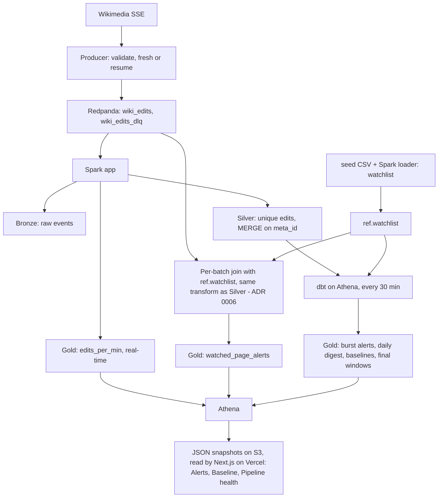

# WikiWatch v1: Real-Time Brand Page Monitoring

Sep 25, 2026 · Advaith

v1 of the streaming lakehouse project, scoped as a product with a business story. Full technical design: `docs/plan.md`. While building v1, this document wins over `docs/plan.md`.

## Business story

WikiWatch tells a communications team within 5 minutes when a Wikipedia page they care about is edited in a risky way, instead of someone finding out hours or days later.

**The company (fictional, used to frame requirements)**

Brightline Brands is a consumer goods company with a corporate page, a dozen product pages, and pages for competitors it tracks. Its 4-person communications team is responsible for how the company appears online.

**The problem**

- Wikipedia content flows into search results, knowledge panels and AI assistant answers, so a bad edit on a brand page can spread well beyond Wikipedia.
- Today the team checks key pages manually, roughly once a day. Vandalism, large content removals or edit wars can sit unnoticed for hours.
- When something does happen, nobody can answer basic questions quickly: what changed, how much, by what kind of account, and is this normal activity for this page?

**Who uses it**

| User | Need | Where they get it |
| --- | --- | --- |
| Communications analyst | Know fast when a watched page has a risky edit | Alerts page, refreshed every 5 minutes |
| Communications lead | A daily view of what changed across all watched pages | Daily digest |
| Data engineer (you) | Confidence the alerts are complete and on time | Pipeline health page |

**The product**

WikiWatch consumes the live stream of every edit across Wikimedia projects, filters it against a watchlist of pages, applies alert rules, and shows the results on a dashboard. Platform-wide activity is kept as a baseline, so the team can tell a genuine spike on their page from a busy day on Wikipedia.

**What WikiWatch does not do:** it never edits Wikipedia. Responses go through Wikipedia's normal channels (talk pages, vandalism reports) and follow its conflict-of-interest guidelines. Detection only.

**What success looks like**

| Metric | v1 target |
| --- | --- |
| Time to detect a per-edit alert (edit time to alert visible), p95 | Under 5 minutes |
| Completeness: watched-page edits in Silver that have an alert row | 100% |
| Freshness of Silver during a session | Under 5 minutes behind |
| Cost per monitoring session (3 hours) | Under $1 |

## v1 scope

v1 is the smallest version that delivers the business story end to end on AWS and could be shown publicly on its own.

| Area | v1 | v2 | v3 |
| --- | --- | --- | --- |
| Ingestion | SSE producer with `fresh`/`resume` modes, Redpanda, schema validation, DLQ | Producer metrics topic | - |
| Watchlist | Static list managed as a dbt seed, loaded to `ref.watchlist` | Live watchlist in RDS with Debezium CDC and SCD2 history | - |
| Processing | One Spark app: Bronze append, Silver insert-only MERGE, real-time windows, per-edit alerts | - | - |
| Batch models | dbt on Athena: final windows, baselines, burst alerts, daily digest | More models as needed | - |
| Orchestration | Airflow with 2 DAGs: `dbt_gold`, `freshness_monitor` | `iceberg_maintenance`, `backfill` | - |
| Dashboard | Next.js on Vercel, 3 pages: Alerts, Baseline, Pipeline health | Full 7-page observatory | - |
| Infra | Terraform foundation + compute, nightly auto-destroy, budget stop | - | - |
| CI | Unit, contract, end-to-end replay, Terraform plan, gitleaks | - | - |
| Proof | README with measured v1 numbers | - | Soak test, drills, backfill demo, ADRs, failure-mode table |

**Deliberately left out of v1:** CDC, SCD2, Slack delivery, Iceberg maintenance jobs (sessions are short enough that small files stay manageable; a one-off compaction script is enough), and the soak test.

## Requirements traceability

Every v1 component exists because a business requirement needs it; this table is the answer to "why did you build that?"

| ID | Business requirement | Data requirement | Component |
| --- | --- | --- | --- |
| BR1 | Know within 5 minutes when a watched page gets a risky edit | Per-edit processing latency under 2 minutes; watchlist lookup in the stream | Producer, Redpanda, Spark stream-static join, `gold.watched_page_alerts` |
| BR2 | Never miss an edit on a watched page | No loss on reconnect or restart; no duplicates inflating counts | `resume` mode, S3 event ID, Silver insert-only MERGE, reconciliation test |
| BR3 | Spot unusual bursts of activity on a page | Edit counts per page over 10-minute windows | dbt `gold.burst_alerts` |
| BR4 | Judge whether activity is abnormal | Platform-wide edits per minute and bot share as a baseline | `gold.edits_per_min`, `gold.edits_per_min_final`, `gold.bot_ratio_hourly` |
| BR5 | A daily summary for the lead | Per-page daily changes, net bytes, editor types | dbt `gold.watchlist_daily_digest` |
| BR6 | Trust the alerts | Visible freshness, record funnel, rejected events | `freshness_monitor`, `ops.stream_progress`, DLQ, Pipeline health page |
| BR7 | Change the watchlist without a code deploy of the stream | Watchlist read fresh every micro-batch | `ref.watchlist` Iceberg table from a dbt seed (v2: live CDC) |
| BR8 | Protect editor privacy and company secrets | No IP addresses shown; no credentials anywhere public | Editor-type classification, security controls from the main plan |

## v1 architecture

One stream, one Spark application, and dbt on Athena; per-edit alerts come from the stream in about 2 minutes, and burst alerts and digests come from dbt every 30 minutes.



**Why the split between stream and batch**

- Per-edit rules (large removal, unregistered editor, page deleted or moved) need only the edit and the watchlist, so they run in the stream and meet the 5-minute target.
- Burst detection needs counts across many edits over 10 minutes. Doing it in dbt keeps the Spark app stateless apart from windows, at the cost of up to 30 minutes of latency for bursts. This trade-off is stated in the README.
- The watchlist is a small Iceberg table read as the static side of a stream-static join. Spark re-reads it each micro-batch, so watchlist changes apply within a minute without restarting the stream.

## Alert rules

Five rules, each with a fixed ID and severity; thresholds live in `ref.alert_rules` (a dbt seed) so they can be tuned without code changes.

| Rule | Condition | Severity | Computed in | Expected latency |
| --- | --- | --- | --- | --- |
| R1 Page deleted or moved | Log event with `log_type` delete or move and `log_action` delete, delete_redir, move or move_redir on a watched page (restores and revision hiding excluded, ADR 0006) | High | Spark | About 2 min |
| R2 Large removal | `length.new - length.old` at most -2,000 bytes, or more than 20% of the page removed | Medium (High if R3 also true) | Spark | About 2 min |
| R3 Unregistered editor | Editor is an IP address or a temporary account (name pattern; verify the current format in the first session) | Low (raises R2 to High) | Spark | About 2 min |
| R4 Protection change | Log event with `log_type` protect on a watched page | Low | Spark | About 2 min |
| R5 Edit burst | 5 or more edits on one watched page within a 10-minute window | Medium | dbt | Up to 30 min |

**Rules for the rules**

- Only article namespace (`namespace = 0`) edits count; talk and user pages are ignored in v1.
- Bot edits never raise R2 or R3, but they still count toward R5 and the baselines.
- Each alert has a deterministic `alert_id` (hash of rule ID and `meta_id`, or rule ID, page and window for R5), so reprocessing never creates duplicate alerts.
- The dashboard shows the editor type (registered, unregistered, bot), never an IP address.

## v1 data model

Twelve tables across five databases; all Iceberg except the ops logs, all partitioned by UTC date.

| Database | Table | Grain | Written by |
| --- | --- | --- | --- |
| ref | `watchlist` | one row per watched page: `wiki`, `title`, `category` (own brand, product, competitor), `owner_team` | Spark loader from the `dbt/seeds/` CSV (ADR 0006) |
| ref | `alert_rules` | one row per rule: ID, severity, thresholds | Spark loader from the `dbt/seeds/` CSV (ADR 0006) |
| bronze | `wiki_edits_raw` | one row per received event, duplicates kept | Spark |
| bronze | `wiki_edits_dlq` | one row per rejected event with error reason | Spark |
| silver | `wiki_edits` | one row per unique edit (`meta_id`), typed, with `editor_type`, `byte_delta`, `is_late`, `processed_at` | Spark (insert-only MERGE) |
| gold | `edits_per_min` | wiki x 1-minute window, real-time | Spark (append) |
| gold | `watched_page_alerts` | one row per alert from R1 to R4 | Spark (insert-only MERGE on `alert_id`) |
| gold | `burst_alerts` | one row per R5 alert | dbt (incremental merge) |
| gold | `edits_per_min_final` and `bot_ratio_hourly` | complete windows and hourly baselines | dbt |
| gold | `watchlist_daily_digest` | watched page x day: edits, net bytes, editor-type mix, alert counts | dbt |
| ops | `stream_progress` | one row per micro-batch per query | Spark listener (JSON on S3) |

**Watchlist seed:** 60 pages covering well-known consumer brands, their flagship products and main competitors, all on English Wikipedia. Company and product pages only, no biographies of living people, to keep the public dashboard low-risk.

## v1 dashboard

Three pages: one for the analyst, one for context, one that proves the data can be trusted. Built with Next.js and deployed on Vercel, the app reads small JSON snapshots exported from Athena, so pages load fast and keep working after the compute stack is destroyed.

| Page | For | Shows |
| --- | --- | --- |
| Alerts | Communications analyst | Open alerts sorted by severity and time; filters by rule, category and page; per alert: page, rule, byte change, editor type, time since edit; last 7 days of daily digest per page |
| Baseline | Communications lead | Platform edits per minute (real-time vs final, with the gap shaded), bot share by hour, a watched page's activity against its own average per recorded hour (sessions are not continuous, so averages use only hours when the pipeline was running) |
| Pipeline health | Data engineer, reviewers | Freshness per layer (Bronze, Silver, Gold), record funnel for the last session (received, Bronze, Silver after dedup, DLQ), micro-batch duration and input rate, time to detect p50/p95, last dbt run status, "offline since" banner when no session is running |

The Pipeline health page is intentionally on the main navigation, not hidden: the point of v1 is that the alerts are only as good as the pipeline behind them.

**How data reaches the app**

The public site never queries Athena. Page views cost nothing, bots can't run up a bill, and the site needs almost no AWS permissions.

1. After each `dbt build`, the `dbt_gold` DAG runs a fixed set of partition-pruned Athena queries and writes `alerts.json`, `baseline.json` and `meta.json` to `s3://<lake>/dashboard/v1/`. Each file is capped (for example, the last 7 days of alerts, at most 500 rows) and stays well under 1 MB.
2. `freshness_monitor` rewrites `health.json` every 5 minutes, so the Pipeline health page is never more than about 5 minutes stale during a session.
3. Next.js server components fetch the snapshots with the AWS SDK, using Vercel's OIDC federation to an IAM role that can only read `dashboard/`. Pages revalidate every 5 minutes.
4. When `meta.json` is more than 15 minutes old, the app shows "Pipeline offline since <time>, showing last session".

**Snapshot contract:** every snapshot carries a `schema_version` and is validated against a JSON Schema in `schemas/dashboard/`, both when the DAG writes it and when the app reads it. A breaking change fails CI, the same way the event schema does.

**Environments:** locally, the app reads snapshots from SeaweedFS or from `web/fixtures/`. Vercel preview deployments for pull requests use the fixtures only; the AWS role trusts the production environment alone. Production deploys happen when `main` changes. Vercel's free Hobby plan covers a personal, non-commercial portfolio site.

## Infrastructure, security and cost

v1 uses the full infrastructure, security and cost design from the main plan, minus RDS; nothing about safety is deferred to later versions.

**Infrastructure in v1**

- `foundation/` stack: S3 lake bucket (no versioning), Glue databases `ref`, `bronze`, `silver`, `gold`, `ops`, Athena workgroup, IAM roles, budget with $50 stop action.
- `compute/` stack: VPC, S3 gateway endpoint, one t4g.xlarge running Docker Compose (Redpanda, Spark, Airflow). No RDS in v1.
- Workflows: `demo-up`, `demo-down`, and the nightly auto-destroy.

**Security in v1 (all mandatory)**

- GitHub OIDC for CI, no stored AWS keys; gitleaks in pre-commit and CI; push protection on.
- Secrets in SSM Parameter Store (Airflow admin password, Fernet key), never in git or Terraform state.
- No open ports; UIs through SSM port forwarding.
- Vercel: OIDC federation to an IAM role that can only read the `dashboard/` snapshot prefix, so no AWS keys are stored anywhere. AWS calls run only in server code, never in the browser or through `NEXT_PUBLIC_` variables. Error details are hidden, and no page shows bucket names, account IDs, hostnames or IPs.

**Cost for v1**

| Item | Estimate |
| --- | --- |
| 10 sessions x 3 hours (EC2, IPv4, S3 requests) | About $6 |
| Persistent lake and snapshot export queries during v1 (Vercel Hobby is free) | About $1 |
| **v1 total** | **About $7 of the $100 credits** |

## Testing and CI

The end-to-end replay test proves the business promise, not just the code: a known set of edits on watched pages must produce exactly the expected alerts.

| Test | What it proves | Runs |
| --- | --- | --- |
| Unit (pytest, local Spark) | Parsing, `editor_type`, `byte_delta`, each alert rule R1 to R4, `alert_id` determinism | Every PR |
| Contract | Fixture events match `schemas/`; schema changes are backward compatible with the version in `main` | Every PR |
| dbt (dbt-trino, local Trino) | R5 burst logic and digest on seed data; uniqueness of `meta_id` and `alert_id`; not-null and accepted-values tests | Every PR |
| End-to-end replay | ~5,000 recorded events with injected duplicates, late events, a malformed event and scripted edits on 3 watched pages. Asserts: zero duplicate `meta_id` in Silver, exactly the expected alert IDs, 1 DLQ row, window totals | Every PR |
| Infra | `terraform fmt`, `validate`, `plan`, `tflint` | PRs touching `infra/` |
| Security | gitleaks on the diff and full history | Every PR |

The fixture is recorded from the live stream once, then edited by hand to add the scripted cases; it contains no IP addresses.

**Frontend checks:** TypeScript type check, ESLint and `next build` on every PR, plus a contract test that validates exported snapshots against `schemas/dashboard/`. Vercel preview deployments run on fixture snapshots, never on AWS data.

## Acceptance criteria

v1 ships when every box is checked and the numbers come from a real AWS session, not from local runs.

**Business**

- [ ] A scripted edit scenario on the fixture produces the expected R1 to R5 alerts and nothing else
- [ ] On AWS, time to detect for per-edit alerts is under 5 minutes at p95 over at least one 3-hour session
- [ ] 100% of watched-page edits in Silver have a matching alert row where a rule applies (reconciliation query in the README)
- [ ] Changing a threshold in `ref.alert_rules` takes effect within one micro-batch, without restarting Spark

**Engineering**

- [ ] `make up` runs the whole v1 stack locally on the M1 Air
- [ ] `resume` mode after killing the producer shows zero missing event IDs over the gap
- [ ] Silver has zero duplicate `meta_id`; Gold has zero duplicate `alert_id`
- [ ] Both Terraform stacks apply and destroy cleanly from GitHub Actions; nightly auto-destroy verified once
- [ ] CI green on `main`, including the end-to-end replay test

**Safety**

- [ ] gitleaks clean on full history; nothing sensitive in state, logs, the app or screenshots
- [ ] No IP addresses anywhere in the dashboard, fixture or README
- [ ] Budget alerts and the $50 stop action configured; v1 spend under $10

**Public**

- [ ] Dashboard live on Vercel, reading only exported snapshots, with the offline banner verified after `demo-down`
- [ ] README complete with the business story, architecture, measured numbers and how to run it

## README headline and resume bullet

Fill the bracketed numbers from your first full AWS session; never publish estimates as results.

**README opening (first screen of the repo)**

```markdown
# WikiWatch: real-time brand page monitoring on a streaming lakehouse

Communications teams find out about risky Wikipedia edits hours late.
WikiWatch streams every Wikimedia edit, checks it against a watchlist,
and raises alerts in under [X] minutes (p95), with zero duplicates
and zero missed edits across restarts.

Kafka (Redpanda) -> Spark Structured Streaming -> Apache Iceberg on S3
-> dbt on Athena -> Next.js on Vercel. Deployed with Terraform, tested end to
end in CI, run for about [$Y] per session.

[Live dashboard] [Architecture] [How to run locally]
```

**Resume bullet**

Engineered WikiWatch, a Kafka, Spark and Iceberg streaming pipeline on AWS replacing manual Wikipedia brand-page checks, detecting risky edits in under 5 minutes with zero duplicates.

**Interview one-liner**

"I built a real-time alerting system for a communications team, and the interesting part was making the alerts trustworthy: no lost or duplicated edits across crashes, even though the broker is rebuilt every session."
